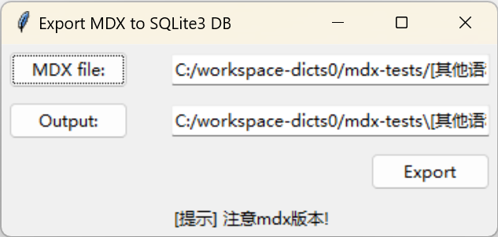

# mdict-utils-gui for export MDICT mdx to huadict Sqlite3 DB

huadict is a Sqlite3 DB based open-format dictionary app.

Use mdict-utils as the mdx parser.

Tested with Python 3.11.

## venv
```
> py -m venv .venv
```

## build
```
> py -m build
```

```
...
Successfully built mdict_utils_gui-0.0.1.tar.gz and mdict_utils_gui-0.0.1-py3-none-any.whl
```


## pyinstaller
```
> pyinstaller gui_exdb.spec
```


Note: modify gui_exdb.spec datas to include required modules.

## screenshots




## huadict sqlite db schema
```
CREATE TABLE dict (id INTEGER PRIMARY KEY AUTOINCREMENT, word text, content text, word1 text, word2 text)
CREATE TABLE info (id INTEGER PRIMARY KEY AUTOINCREMENT, word text, content text, word1 text)

CREATE INDEX idx_dict ON dict (word)
```

## References

1. [mdict-utils](https://github.com/liuyug/mdict-utils)

2. [python tutorials on packaging-projects](https://packaging.python.org/en/latest/tutorials/packaging-projects/)

3. [python tutorials on tkinter](https://www.pythontutorial.net/tkinter/tkinter-grid/)
4. [tkinter docs](https://docs.python.org/3.11/library/tkinter.html)
